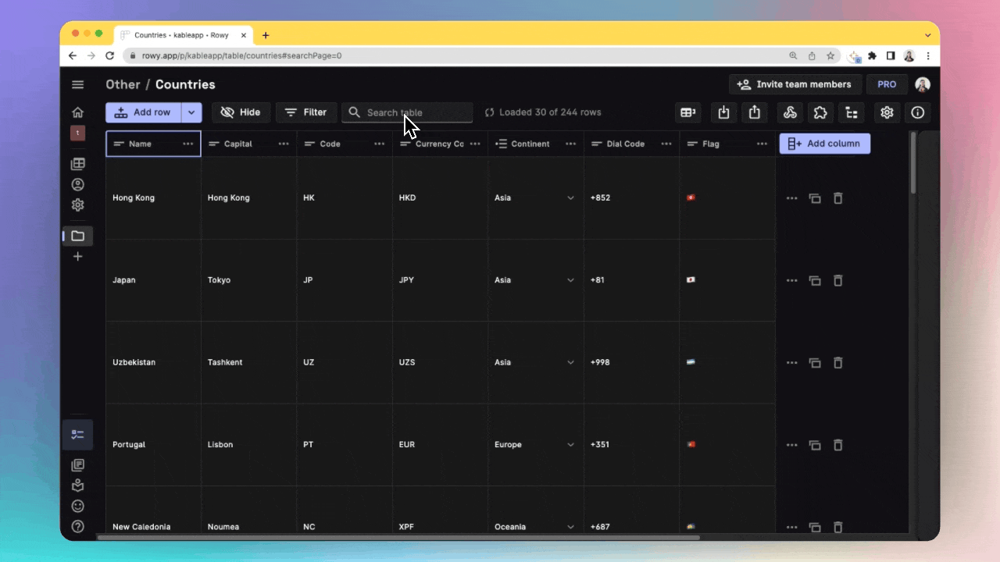
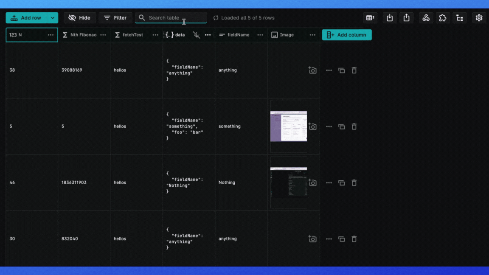

import meilisearchImg from "./assets/meilisearch.png"
import projectSettings from "./assets/projectsettings.png"
import textSearch from "./assets/textSearch.png"
import enableTextSearch from "./assets/enableTextSearch.png"

Search across your Firestore collections with ease and manage your data on Rowy Table CMS. You don't have to worry about typing the search term in case-sensitive manner or knowing the full search term.  

Rowy's fulltext search feature for Firebase is powered by Meilisearch.

# Enabling Search in your project

:::note Rowy Pro required
Rowy search feature is only available for Rowy Pro Users - please upgrade your workspace if you have not already done so.

:::

Follow the steps below to enable the full text search feature in your project:

## Step 1: Setup account on meilisearch

Under the project settings page of Rowy, add your meilisearch search URL instance and key.

### To setup MeiliSearch account
☑️ Go to the [MeiliSearch Developer Portal](https://cloud.meilisearch.com/projects) and sign up if haven't already.
:::info MeiliSearch Manual Installation

For users who wish to follow the manual self-hosted installation of MeiliSearch, please refer to [this guide](https://docs.meilisearch.com/learn/getting_started/quick_start.html#setup-and-installation) by MeiliSearch.

:::

☑️ Click on Create a new Project on the top right corner. 

☑️ Enter a unique **Project Name**, select a **Region** and a **MeiliSearch** version from the dropdown, and select a plan. Click on **Create Project**.

☑️ Copy over the **Search Instance URL** and the **Master Key** and add them under Rowy Project settings.

☑️ In Rowy, go to the **Project Settings** tab. Under the **Services** tab, paste the **Search Instance URL** and the **Master Key** in the **Full Text Search** section. Click on **Enable**. This will enable the full text search feature in your project.

## Step 2: Enable the tables you want to search

You can enable the search feature on specific table collections that you want to be able to search by indexing them on MeiliSearch.

Click on the toggle in the **Table Settings** for that particular table.

## Step 3: Start searching 🚀

Now you can go back to your Rowy table, and start searching! 

