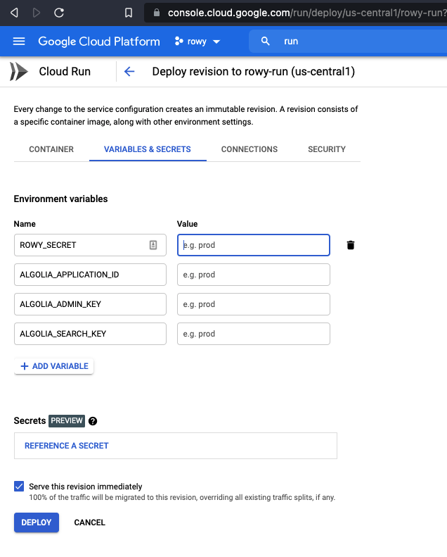

# Connect Table Field

Connect table uses algolia indices to create a connection between tables

## Prerequisite 

You'll need to index your table data on algolia, use can use the [algoliaIndex extension](../extensions/algolia-index) to do so

## Setup

