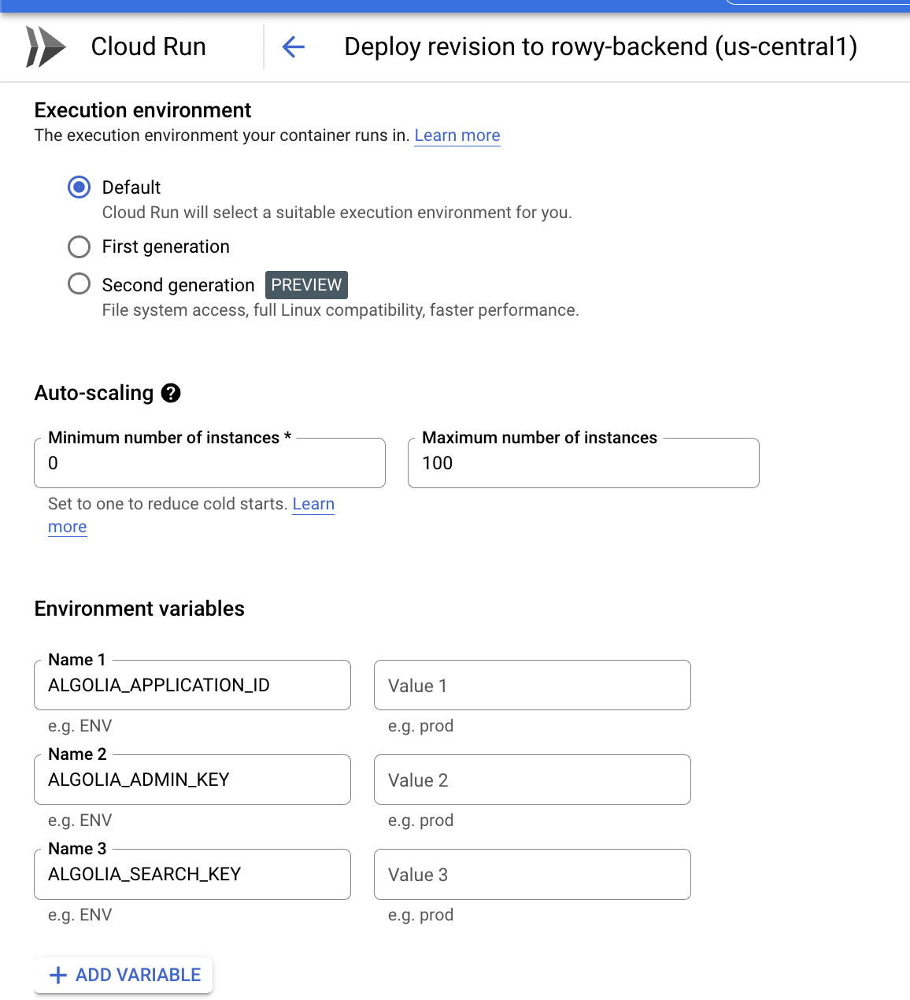

Connects table field creates a connection between tables to fetch a snapshot of data values from another existing table's row. This is done via algolia index and needs integration.

## Prerequisite

You'll need to index the table data you want to connect to on algolia. To do this you can use [algoliaIndex extension](../extensions/algolia-index).

## Setup

- Go to the [Rowy Backend cloud run](https://console.cloud.google.com/run/deploy/us-central1/rowy-backend) Configuration
- Under the "Variables & Secrets" tab, add the following variables (you should be able to find them on your Algolia dashboard)

```
ALGOLIA_APPLICATION_ID
ALGOLIA_ADMIN_KEY
ALGOLIA_SEARCH_KEY
```



## Create the connection


