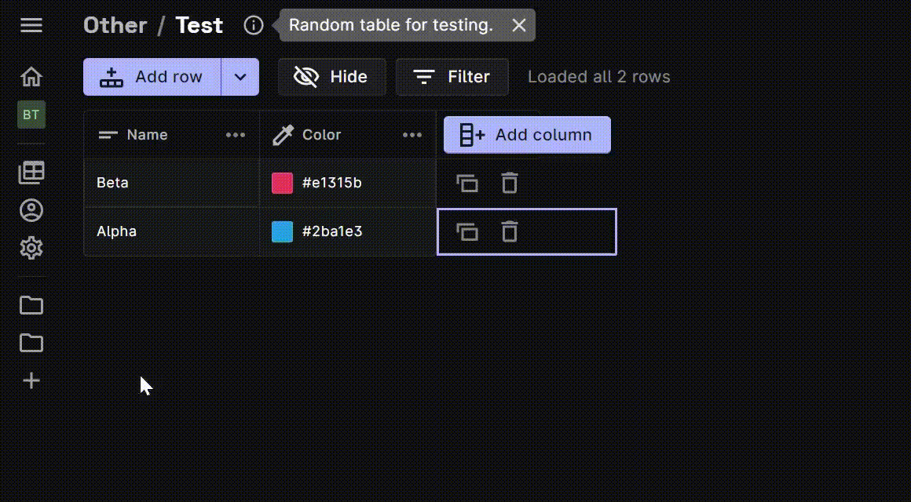

Rows display individual documents in your Firestore collection.

## Steps

1. Click the **Add row** button above the table.
2. Choose from any of the three modes for adding a new row, i.e. **To top**, **With random ID**, and 
**With custom ID**.
3. You can edit fields directly in the row or the Side Drawer.

## Modes for adding a row

Every row has a **distinct Row ID** which helps to differentiate it from the other rows. Data stored in the
Firebase Firestore is **sorted in ascending order** in the Rowy Table, according to the Row ID.

## Notes

- If a column is set to **required**, the row will not be written to Firestore
  until the field’s value is set.
- If a column has a [default value](./default-values.mdx) set, it will
  automatically set values after you add the row.
