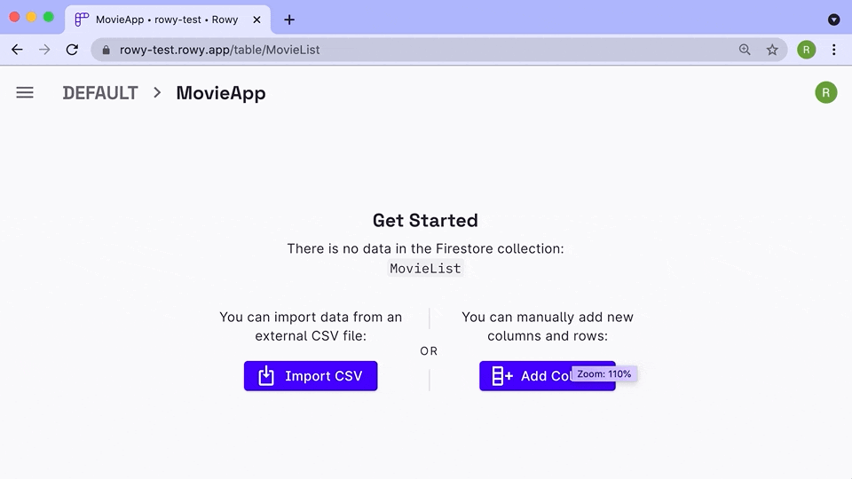

Click on the "Add Column" button on the right most side of your table. Add your
column information, pick column type from one of the
[30+ supported fields](../field-types/supported-fields.mdx) and configure them
to your needs.

### Note

- You can create default values for fields, read about it in detail
  [here](./default-values.md)
- You also have flexibility to make some column fields required, i.e. only if
  this column value is added then the row will be saved
- You can validate data operations with regex on certain column types

