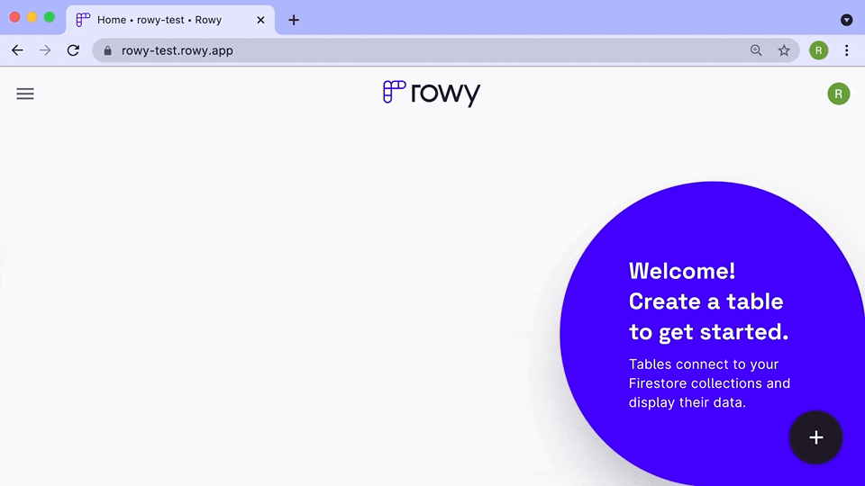

Click the plus icon on the bottom-right corner of the Rowy app home page and follow the instructions to add your table details.

### Note
- You can create multiple views of the same collection using different TableIDs
- The first time you create a table, you need to add a section (suggested: "DEFAULT") and permission role of who can see it (as "ADMIN")
- If you delete a table, only the config of the table on Rowy will be removed and the actual contents of the collection on your Firestore will not be deleted

