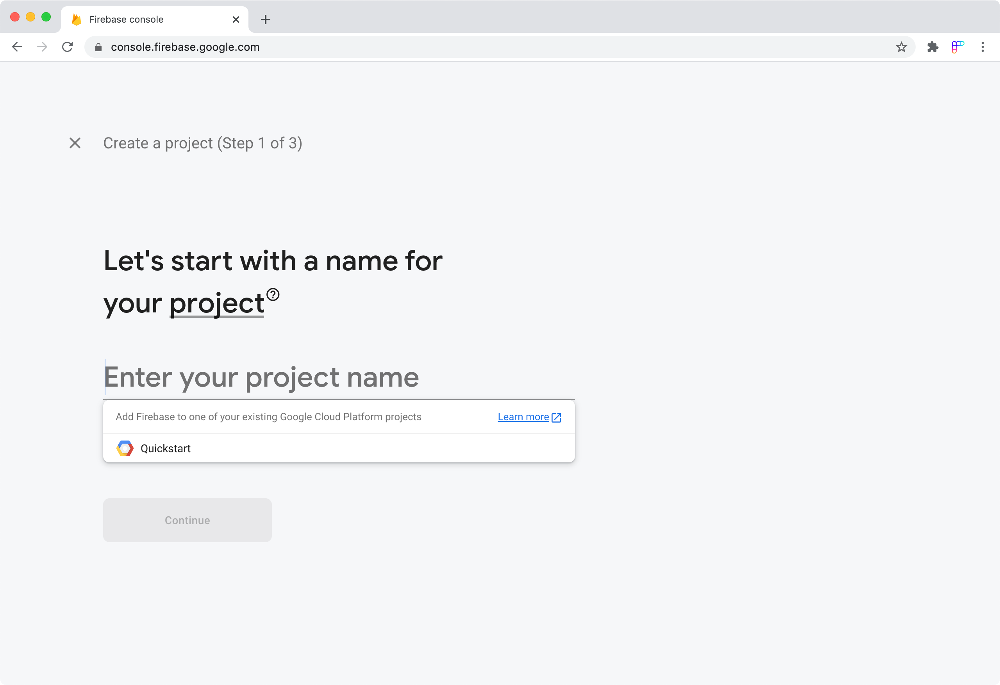
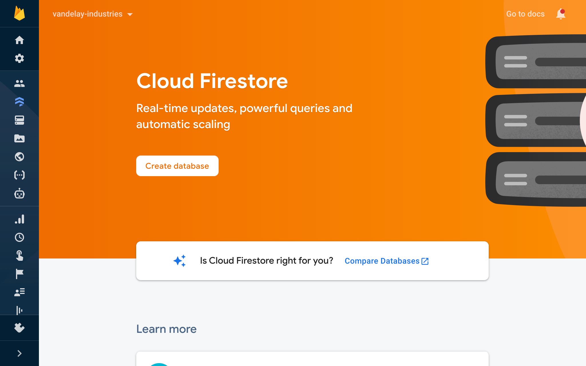
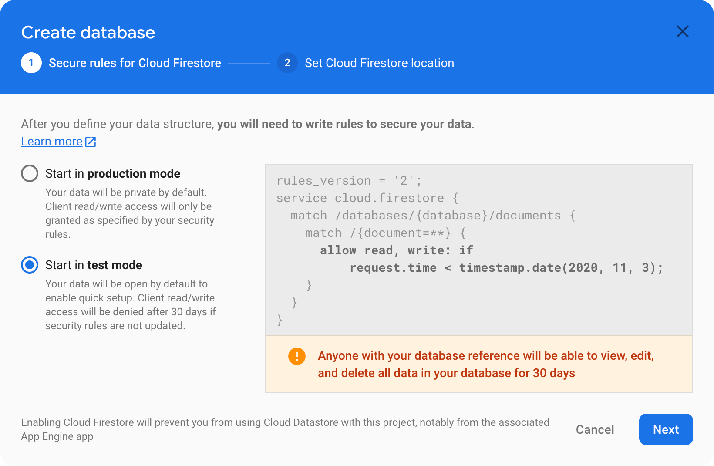
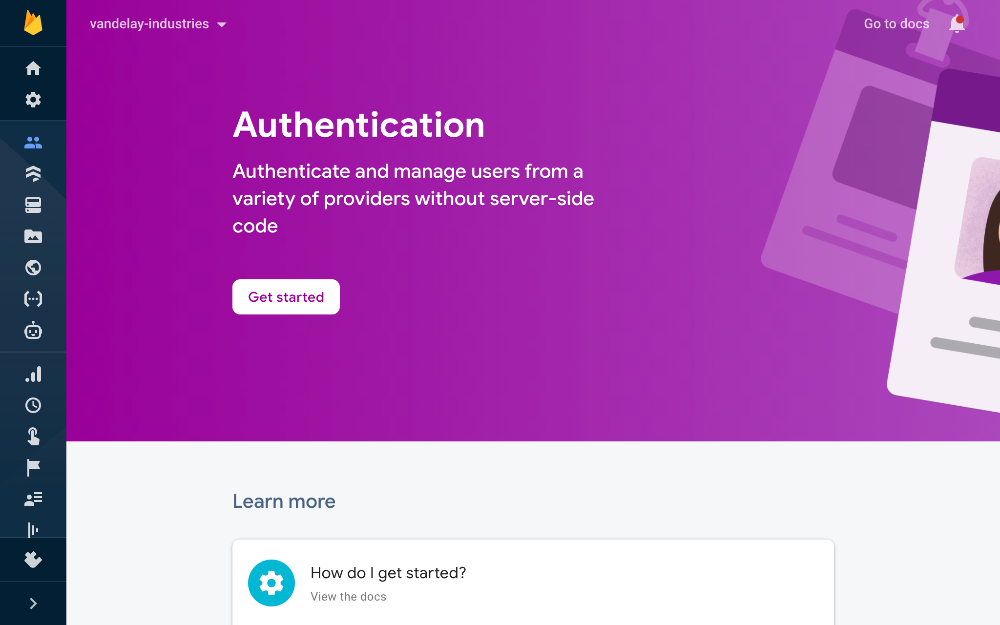
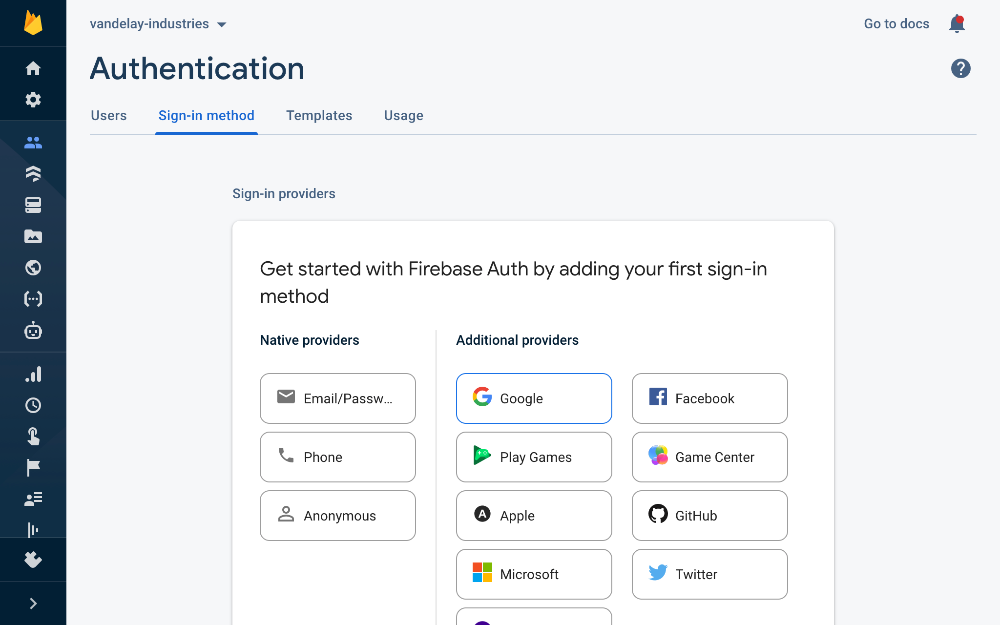
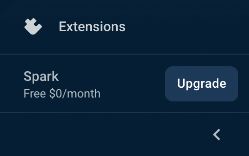

Rowy connects to your existing Firebase projects. Your projects must have
Firestore and Authentication enabled.

1. Create a **new project** in the
   [Firebase Console](https://console.firebase.google.com/).

   

2. Create a **Firestore** database in the
   [Firebase Console](https://console.firebase.google.com/project/_/firestore).  
   [Firebase instructions&nbsp;&UpperRightArrow;](https://firebase.google.com/docs/firestore/quickstart#create)

   

3. Set up Firestore **Security Rules**. You can use test mode for now.

   

   - Alternatively, you could allow unlimited access to the entire database for
     testing. Once you have created your database, paste the following code in
     the
     [Rules tab](https://console.firebase.google.com/project/_/firestore/rules):

     ```js
     rules_version = '2';
     service cloud.firestore {
       match /databases/{database}/documents {
         match /{document=**} {
           allow read, write: if true;
         }
       }
     }
     ```

4. Enable **Firebase Authentication** in the
   [Firebase Console](https://console.firebase.google.com/project/_/authentication).

   

5. Enable the **Google sign-in method** in the
   [Sign-in method tab](https://console.firebase.google.com/project/_/authentication/providers).  
   [Firebase instructions&nbsp;&UpperRightArrow;](https://firebase.google.com/docs/auth/web/google-signin)

   

6. **Optional:** In the bottom-left corner, upgrade your project to the **Blaze
   Plan**.

   This is required to deploy Rowy Run and any Cloud Functions. The
   [free Spark Plan limits](https://firebase.google.com/pricing) are generous
   and you likely won’t pay anything.

   
