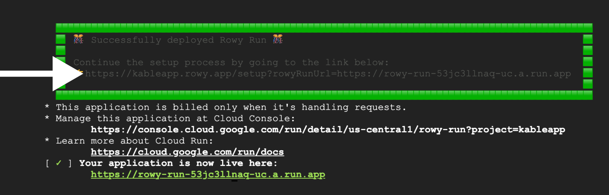

Set up Rowy on your Google Cloud or Firebase project in minutes.

## Option 1: Quick deploy — ✅ Recommended

You can set up Rowy using the following one-click deploy button, which will
guide you with a step-by-step process.

:::warning Required

Before starting, make sure you have a Google Cloud or Firebase project with
**Firestore** and **Firebase Authentication** enabled.

Don’t have a project? [Learn how to create one&nbsp;→](./firebase-project.md)

:::

When you’re ready, click the button:

[](https://rowy.app/deploy)

This runs [Rowy Run](../rowy-run/overview.mdx), an open source Cloud Run
instance that operates exclusively on your Google Cloud project, so we never
have access to any of your data. Like Rowy, it’s completely open source and free
to use.

Once installed, you’ll be given an URL to the Rowy app to continue installation:



## Option 2: Manual install

If you don’t want to set up Rowy as described above, you can follow these steps
to install it manually for development before hosting it yourself.

:::warning Required

Before starting, make sure you have a Google Cloud or Firebase project with
**Firestore** and **Firebase Authentication** enabled.

Don’t have a project? [Learn how to create one&nbsp;→](./firebase-project.md)

:::

:::note Required software

- [Git](https://git-scm.com/downloads)
- [Node](https://nodejs.org/en/download/) 10+ (it’s easiest to install using
  [nvm](https://github.com/nvm-sh/nvm#intro))
- [Yarn](https://classic.yarnpkg.com/en/docs/install/) 1
- [Firebase CLI](https://firebase.google.com/docs/cli) 8+

:::

1. Make sure you’re logged in to your Firebase account in the Firebase CLI:

   ```bash
   firebase login
   ```

2. Clone the Rowy repo and open the created directory.

   ```bash
   git clone https://github.com/rowyio/rowy.git
   cd rowy
   ```

3. Set environment variables.

   - Create a `.env` file.
   - Get the **Project ID** and **Web API key** in the
     [Firebase Console&nbsp;&UpperRightArrow;](https://console.firebase.google.com/project/_/settings/general)  
     Can’t see it?
     [Enable Firebase Authentication&nbsp;&UpperRightArrow;](https://console.firebase.google.com/project/_/authentication)
     first.
   - Paste them in the `.env` file:
     ```bash
     REACT_APP_FIREBASE_PROJECT_ID =
     REACT_APP_FIREBASE_PROJECT_WEB_API_KEY =
     ```

4. Install frontend dependencies using Yarn.

   ```bash
   yarn
   ```

5. Run the app locally.

   ```bash
   yarn start
   ```

6. Sign in with your Google account. You’ll see an Access denied screen.

7. Set the `ADMIN` role for your account using
   [these instructions&nbsp;&RightArrow;](/setup/roles?set-user-roles-tabs=admin-sdk#set-user-roles)

8. Sign out and sign in again to access your Rowy project.

Some backend features require Rowy Run to be installed on your project. You’ll
need to install Rowy Run manually.
[Install Rowy Run&nbsp;→](../rowy-run/overview.mdx)
