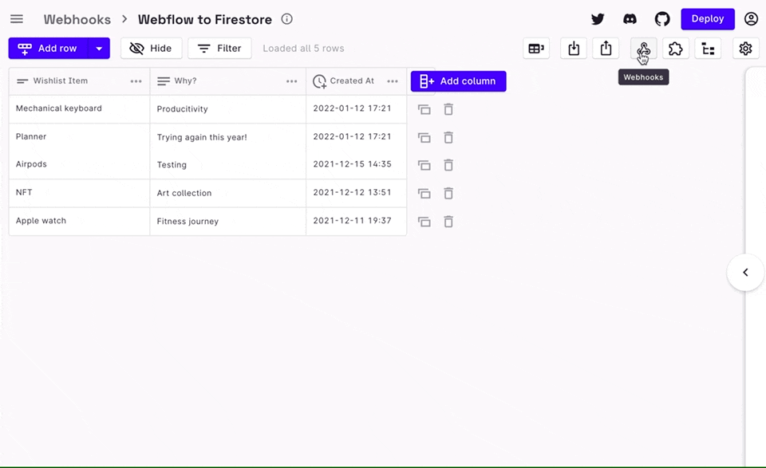

import Video from "../../src/components/Video.js";
import Gist from "react-gist";

Webflow forms are great way to quickly capture useful information from the visitors of your website. 
However, Webflow Forms are limited by its CMS - cost, features, extensibility, scalability. 
With Rowy, you can spin up webhooks instantly to consume Webflow form submissions to your Google Firestore database. 
Learn how in just 3 steps.

### Step 1: Setup a webhook endpoint with Rowy

<a href="https://docs.rowy.io/setup/install#option-1-quick-deploy---recommended" target="_blank">Setup Rowy</a> and <a href="https://docs.rowy.io/how-to/create-table" target="_blank">create a table</a> where you want to collect 
the submissions from a Webflow form. This Rowy table is connected to a Firestore database collection. 

Click on webhook icon to generate an instant webhook endpoint URL. You can add any conditions or custom parser logic.

### Step 2: Connect to your Webflow Form
Setup webflow form on your site as you would typically. Example form below.

However, at the final step of the form setup, instead of using Webflow CMS for submissions, store form data to Firestore. 
-  On Webflow form settings, update the form action method to POST and action URL with the Rowy webhook URL generated in the step above. See example in the first image below.

- Then, under the page settings->custom code section, add the following script in the "before body tag" block as show above on the right image. This script code, tells webflow to use the action URL provided to submit the form data instead of the default Webflow CMS.

     <Gist id="5653a7adbd12bc02ecbe110a760a2143" />
 

### Step 3: Test the connection from Webflow to Firestore via Rowy

Fill the webflow form sample above in step 2, and start seeing data in the Firestore connected Rowy table below.

"}} />

<a href="https://www.rowy.io/deploy" target="_blank">Get started </a>with Rowy  
