import Gist from "react-gist";

Dynamically generating PDF can be super useful in your product and can be used in a variety of use-case.
For example, if you are building an education app and want to issue a certificate to users 
who completed a course or if you want to issue a certificate for some special achievement or goal.

In this tutorial, we're going to explore step-by-step how you can generate a PDF based on a Figma template 
using Rowy's ready to use backend template.

## What you’ll need

- If you don't have a Rowy account, [create one](https://rowy.app) first and then create a new project.
- Clone Rowy's [certificate template](https://www.figma.com/community/file/1153928195162951308) file or create your own PDF design in Figma.

## Step 1: Create and export your PDF design from Figma as SVG

Use Figma to design your PDF file or use this [free and ready-to-use certificate template](https://www.figma.com/community/file/1153928195162951308) we created.
You can clone this template and tweak it to your usecase easily.

[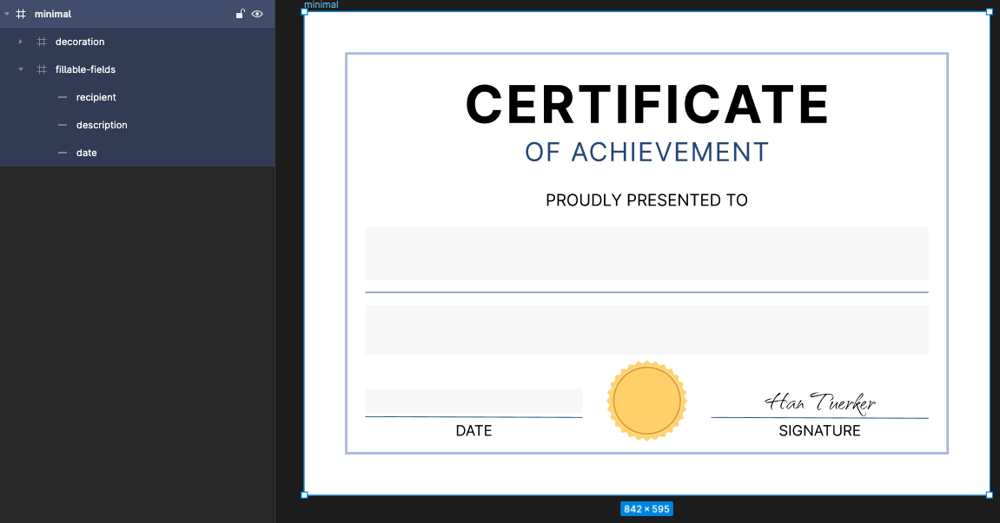](https://www.figma.com/community/file/1153928195162951308)
<div align="center"><small>Figma certificate template file</small></div>
<br/>

Note, to make things easier, there are a couple of things to keep in mind if you are creating your own design from scratch:  
- Use the universal A4 paper format (595x842) in the landscape form (842x595) for the main frame, to avoid any issues regarding the PDF page size.
- Use a rectangle block to specify a fillable field in the template. This will come in handy while making fields responsive.
- Use the `id` attribute's export option which will be helpful to find the proper field in the program logic.

Figma uses the exact name at the sidebar while exporting the SVG. So, be sure that there isn't any conflict. We're going to select the recipient field by the id of "recipient" in the extension logic.

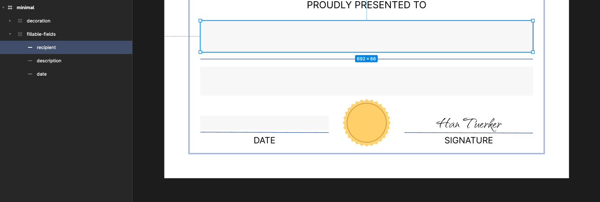

Lastly, don't forget to mark `Include "id" attribute` in the export options.

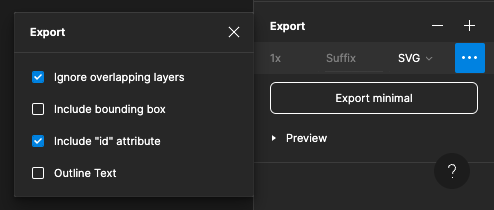

You can preview your SVG template by opening it on your favorite browser, and the design step is done. The text fonts do not look as expected right now, but we'll take care of it later!

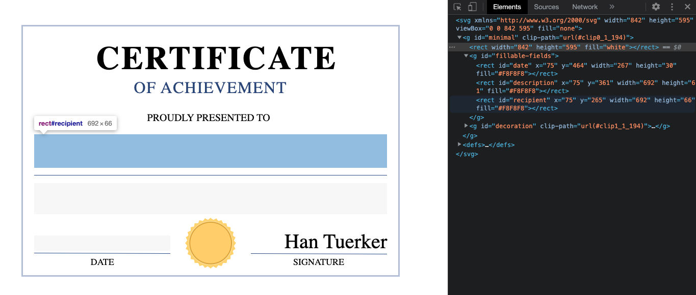

## Step 2: Initialize Rowy table structure

You can do this two ways 

### Option A: Using Table template ✅

**(Recommended)** Simply create a table from template and select the  "Certificate Generator" option.
This is a fully guided process to get you setup with Table and cloud function code in just a few clicks

### Option B: Manual
The table scheme has 4 columns for the inputs of template, and the output column for the generated PDF file:
- `Template` column as `File` type
- `Description Text` column as `Long Text` type
- `Issue Date` column as `Date` type
- `Recipient Name` column as `Short Text` type
- `Certificate` column as `File` type

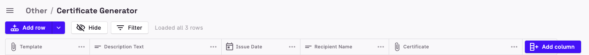

We'll use a single [Rowy Extension](https://docs.rowy.io/extensions), which is simply a cloud function that runs after row-level CRUD operations. The program flow is as simple as when the input fields are created or updated, we'll run a cloud function to generate a PDF file by using the recently created/updated row data.

Create a new extension and set the `Tracked Fields` to all 4 input columns so the extension will get triggered by any changes.

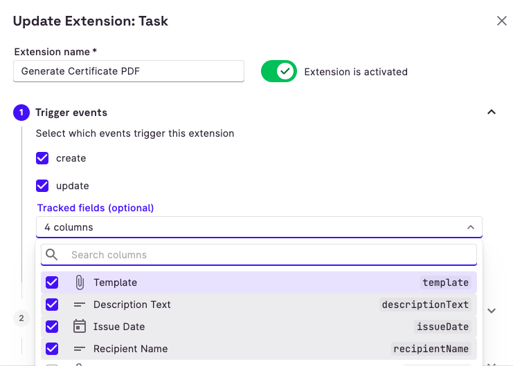

In the `Extension Body`, we’ll write Javascript code. This will be automatically deployed by Rowy as a cloud function.

This function will run using Node.js. So, we can use any NPM packages we'd need to fasten our development.

We'll get benefit of 3 NPM packages:

- `puppeteer`: A headless Chrome launcher
- `jsdom`: DOM manipulation in Node.js
- `dayjs`: Localize Date objects in Node.js


You can use CommonJS modules here to load NPM packages. Rowy detects and installs external libraries while deploying functions.
```tsx
const extensionBody: TaskBody = async ({ row, db, change, ref }) => {
  // Rowy detects and installs external libraries defined as below
  const puppeteer = require("puppeteer");
  const { JSDOM } = require("jsdom");
  const dayjs = require('dayjs');
  const localizedFormat = require('dayjs/plugin/localizedFormat');
  dayjs.extend(localizedFormat);
}
```

The program logic consists of 4 simple consequent steps:
- Retrieve the template from storage
- Parse the template with `jsdom` and manipulate the fields by inputs
- Open the manipulated SVG with `puppeteer` and generate PDF from it
- Upload the PDF to storage, and update the output column


### Retrieve the design template

As we used the `File` column type to store template into storage, Rowy structured our storage file as a Firestore document which helps us to retrieve a file declaratively. `File` consists of an array of files that stored in our Firebase Storage. In this tutorial, we'll only use a single template file, which sits on the zero index of column `template`.

```tsx
const template = await fetch(row.template[0].downloadURL)
  .then(resp => resp.blob())
  .then(data => data.text())
```

### Manipulate the SVG template

The `jsdom` library parses that template from raw text, and creates an emulator through which we can use standard DOM facilities to manipulate our template.

```tsx
const dom = new JSDOM(template);
const { document } = dom.window;
```

Now, we can use DOM selectors to access elements. We'll first create a bunch of auxilary functions to make things more organized such as `createTextElement`, `createStylesElement`, `createForeignObject`, and `getAttributes`.
```tsx
const svg = document.querySelector("svg");
svg.appendChild(createTextElement("description", row.descriptionText));
svg.appendChild(createTextElement("recipient", row.recipientName));
const dateText = dayjs(row.issueDate.toDate()).format("LL");
svg.appendChild(createTextElement("date", dateText));
document.head.appendChild(createStylesElement());
```

The entire DOM manipulation logic applies, but the implementation gets a bit confusing as DOM manipulation itself is an iterative process. 

First, we'll inject a `foreignObject` for every fillable field into the SVG which has the same position as the corresponding rectangle block in our design template. This way, we'll have a `div` element which can we styled using CSS.

```tsx
// Creates a foreignObject element with given attributes
const createForeignObject = (attrs) => {
  const el = document.createElementNS(
    "http://www.w3.org/1999/xhtml",
    "foreignObject"
  );
  Object.keys(attrs).forEach((key) => el.setAttribute(key, attrs[key]));
  return el;
};

// Returns attributes of an element 
// i.e { id: "recipient", x: "50", y: "100", width: "300", height: "175" }
const getAttributes = (el) =>
  el.getAttributeNames().reduce((hash, key) => {
    hash[key] = el.getAttribute(key);
    return hash;
  }, {});

// Creates `div` element with given text
const createTextElement = (targetId, text) => {
  const targetEl = document.getElementById(targetId);
  const attrs = getAttributes(targetEl);
  const foreignObjectEl = createForeignObject(attrs);
  const div = document.createElement("div");
  div.setAttribute("xmlns", "http://www.w3.org/1999/xhtml");
  div.className = targetId;
  div.innerHTML = text;
  foreignObjectEl.appendChild(div);
  return foreignObjectEl;
};
```

Lastly, we'll append CSS styles into document `head` to style our injected elements.

```tsx
// creates a `style` element
const createStylesElement = () => {
  const styleEl = document.createElement("style");
  styleEl.appendChild(
    document.createTextNode(`
    @import url("https://fonts.googleapis.com/css2?family=Inter:wght@400;500;600;700");
    @import url('https://fonts.googleapis.com/css2?family=Qwitcher+Grypen:wght@400;700&display=swap');
    @import url('https://fonts.googleapis.com/css2?family=Rakkas&display=swap');
    body {
      margin: 0;
      padding: 0;
      font-family: "Inter", sans-serif;
    }
    .description, .recipient, .date {
      position: relative;
      top: 50%;
      transform: translateY(-50%);
    }
    .description, .recipient, .date {
        text-align: center;
    }
    .description {
        font-size: 18px;
    }
    .recipient {
      color: #314E85;
      font-size: 40px;
      font-weight: 600;
    }
    .date {
      font-size: 16px;
    }
  `)
  );
  return styleEl;
};
```

### Generate a PDF

`puppeteer` will generate the PDF from manipulated `dom` as shown below.
```tsx
const browser = await puppeteer.launch();
const page = await browser.newPage();
await page.setContent(dom.serialize(), { waitUntil: "networkidle0" });
const pdf = await page.pdf({ printBackground: true });
await browser.close();
```

### Upload file into storage, and update the output column

```tsx
const pdfFile = await rowy.storage.upload.data(pdf, { 
  fileName: "certificate.pdf",
  folderPath: `certificateGenerator/${ref.id}`
});
await ref.update({ certificate: [pdfFile] });
```

## Step 3: Increase RAM allocation

Finally, Rowy deploys the cloud functions with a minimal setup by default which has only 256MB of RAM. The `puppeteer`package cannot operate with this amount of memory. So, as the last step we have to increase the memory of the recently deployed cloud function. You can follow the instructions as specified [here](/tutorials/spotify-wrapped#step-5-increase-ram-allocation).

## Additional Content: Advanced Ticket Generator

### Create template for Tickets

This time, we'll use a template with portrait page format(595x842). The fields are the same as the minimal `Certificate` example, except we're going to include a dynamically generated QR Code, and Google Maps.

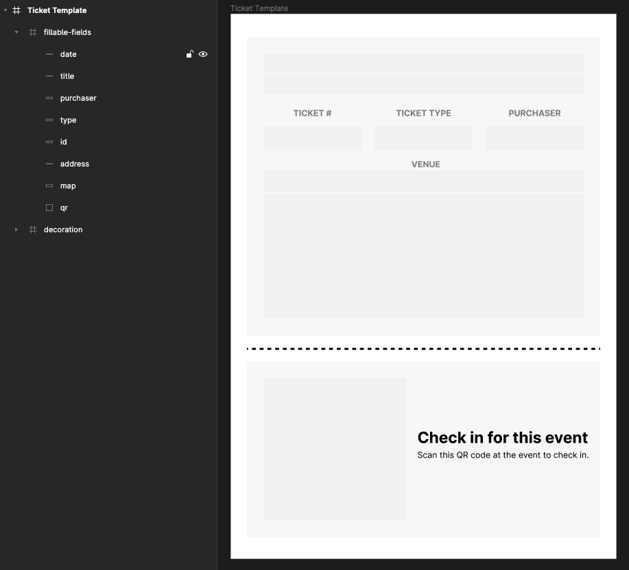

### Initialize Rowy table and subtable structure

We're going to have a more relational data structure now. The main table will store event specific information such as `eventDate`, `eventAddress`, `ticketTemplate`, and the sub-table will store consumer specific information like `purchaserName`, and `ticketType`. 

With this design, we'll be able to generate event specific tickets by using the same template for many tickets with assistance of the relational data structure.

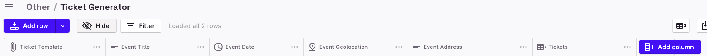


### Creating a Rowy extension for Subcollection

Except QR Code and Maps generation, every step is identical with the previous `Certiciate` example. For this example, we'll going to trigger the extension only after `tickets` subtable got updated. You can define extensions for your subcollections the same way we did for `Certificate` generator. 

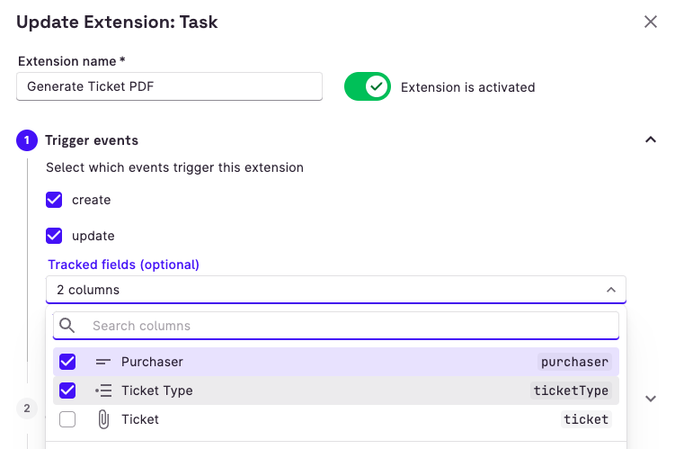

Finally, you can use Rowy’s table UI directly as a admin panel to manage and generate certificates/tickets for your users nocode style or your can connect your app via Firebase SDK or APIs to read and write to this table data and generate certificates because this data is connected directly to your Firestore project.

### Generating QR Code for the Ticket

Generating a dynamic QR Code for the invited users is a highly efficient and benefecial way of validation or confirmation. For integrating the QR Code Generator with the Ticket Generator Extension, we can make use of the npm library called "qrcode".

```js
const QRCode = require("qrcode");
```

Henceforth, we can instantiate the QR code using the module as follows: 

```js
const qrCode = await QRCode.toBuffer("12345");
```

The instance created above is passed as an arguement to the `createQrElement` method that creates a division for the required QR Code.

```js
  const createQrElement = (targetId, qrCode) => {
    const attrs = getAttributes(document.getElementById(targetId));
    const foreignObjectEl = createForeignObject(attrs);
    const div = document.createElement("div");
    div.setAttribute("xmlns", "http://www.w3.org/1999/xhtml");
    div.className = targetId;
    div.style.backgroundImage = `url(data:image/png;base64,${qrCode.toString(
      "base64"
    )})`;
    foreignObjectEl.appendChild(div);
    return foreignObjectEl;
  };
```

Lastly, all we need to do is call this function in our extension and append the generated QR Code to the ticket svg as follows:

```js
svg.appendChild(createQrElement("qr", qrCode));
```

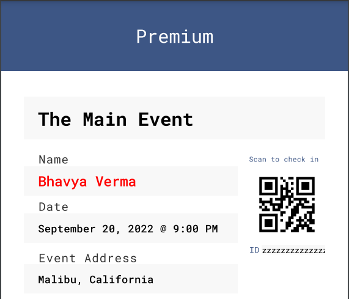

### Pinpointing Event Coordinates on Map

Yet another useful feature of the Ticket Generator Extension is the map svg pinpointing the event's location based on the coordinates. 

The following function creates an svg of the map highlighting the location of the event according to the latitudinal and longitudinal coordinates provided in the table:

```js
const createMapsElement = (targetId, { latitude, longitude }) => {
    const attrs = getAttributes(document.getElementById(targetId));
    const foreignObjectEl = createForeignObject(attrs);
    const div = document.createElement("div");
    div.className = targetId;
    div.setAttribute("xmlns", "http://www.w3.org/1999/xhtml");
    const iframe = `
    <iframe
      id="iframe"
      width="${attrs.width}"
      height="${parseInt(attrs.height) + 300}"
      src="https://www.google.com/maps/embed/v1/place?key=${key}&q=${latitude},${longitude}&zoom=18">
    </iframe>
    `;
    const maps = new JSDOM(iframe);
    div.appendChild(maps.window.document.getElementById("iframe"));
    foreignObjectEl.appendChild(div);
    return foreignObjectEl;
  };
```

Therefore, we can invoke the function in the extension and append the map svg as mentioned below:

```js
svg.appendChild(createMapsElement("map", parentDoc.eventGeolocation));
```

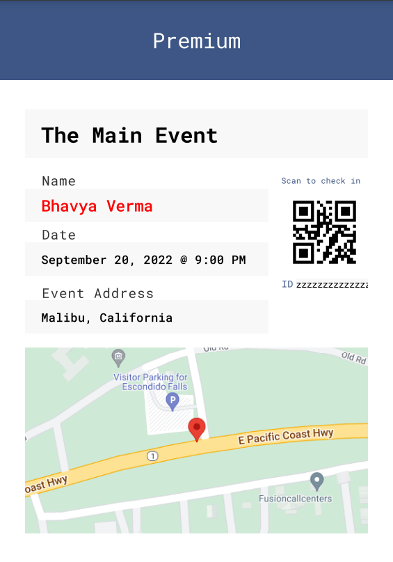