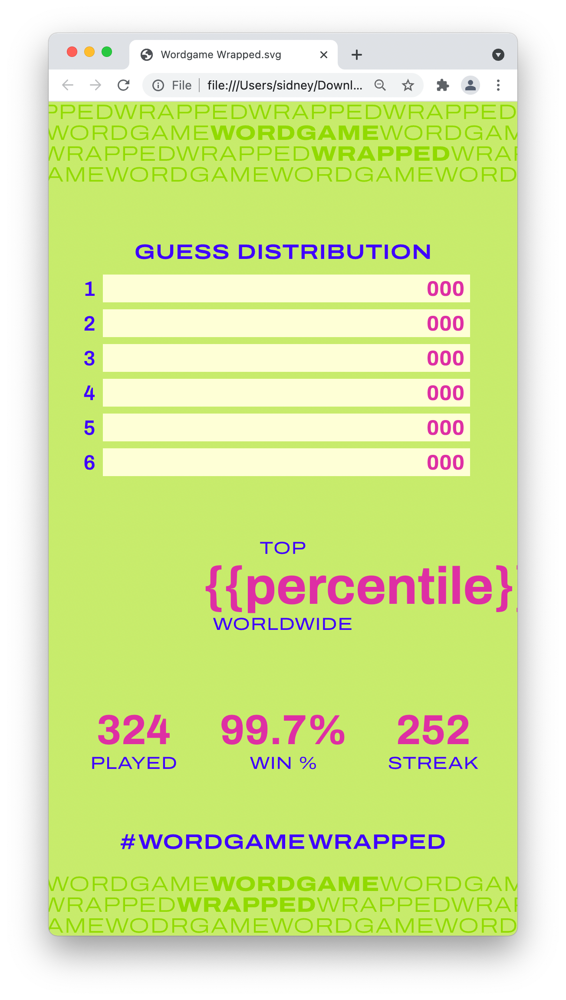
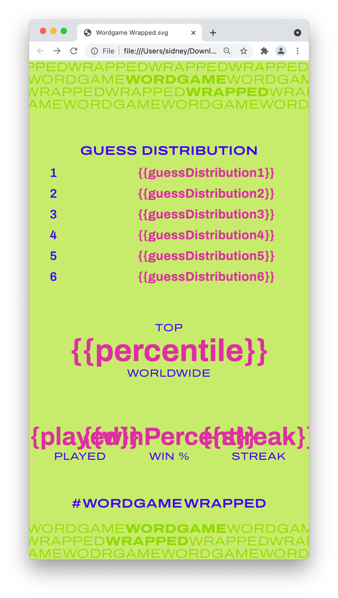
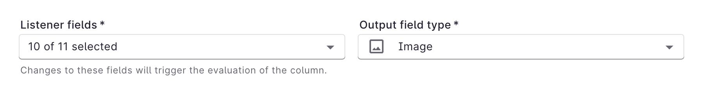
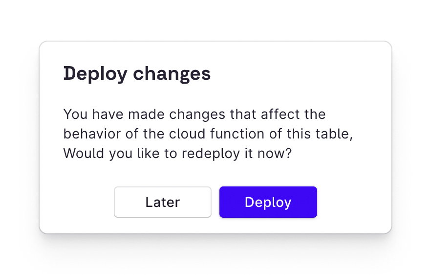
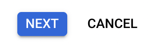
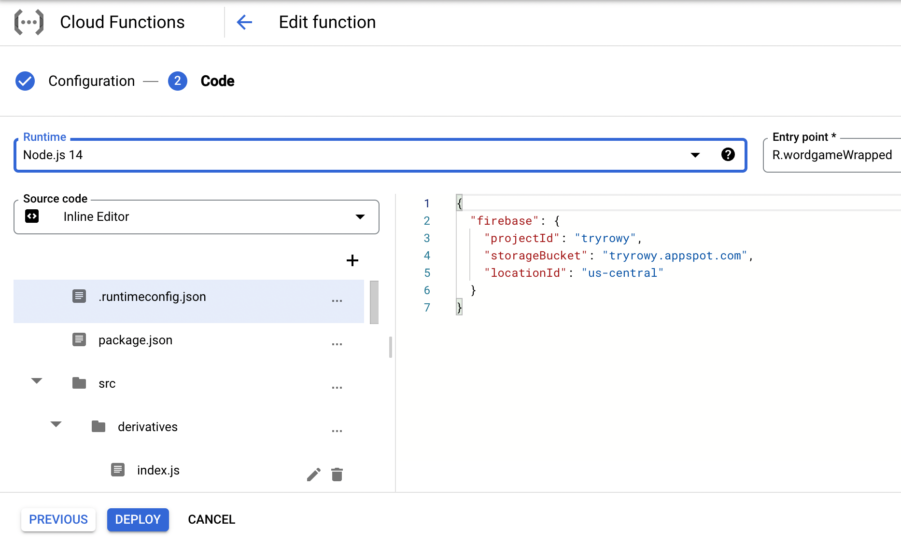

import Video from "../../src/components/Video.js";
import Gist from "react-gist";

Build your own Spotify Wrapped for your app. Go from a Figma design exported as
SVG to auto generated images injected with your user's data. This can be great
tool for creating engagement for your app on social media, image sharable user
images such as Spotify wrapped, wordle scorecard, strava stats etc. With Rowy,
you can build this in just 10 minutes.

<Video url="https://www.youtube.com/watch?v=nA4tj1NT3ZM" />

## What you’ll need

- If you don't have a Rowy account, [create one](https://rowy.app) first and then create a new project.
- [Create a table](https://docs.rowy.io/how-to/create-table) containing the user
  data to be injected into the image template. This can be simple like
  [this demo table](https://demo.rowy.io/table/wordgameWrapped).
- Design an image template in Figma, like this:
  

## Step 1: Export and test the SVG

We’re using SVG because it encodes designs in plain text, and that can be really
easily manipulated to add the user’s data.

Export your template as an SVG, making sure to de-select Outline Text so we can
edit the text later. If you have text that stays static, right-click the text
layer and click Outline stroke. This means we won’t have to worry about finding
the fonts for those layers later.


Open the SVG file in a browser. We’ll be using
[Puppeteer](https://github.com/puppeteer/puppeteer), which runs a headless
version of Chrome, to render the SVG later, so a browser can accurately preview
how it will look.


Your design likely uses custom fonts, so we’ll need to display them correctly.
Since we’re using a browser to render this and SVG supports CSS, we can use web
fonts. Open your SVG in a text editor like VS Code.

This design uses [Archivo](https://fonts.google.com/specimen/Archivo) from
Google Fonts, so we can copy the code snippet they provide. Add it to the SVG
file, right after the opening `<svg ... >` tag.


You’ll need to modify the URL to remove everything after the `&` character to
make it display:

```html
<style>
  @import url("https://fonts.googleapis.com/css2?family=Archivo:wght@700");
</style>
```

Here’s how it looks with all the fonts available:


## Step 2: Add variables to the SVG

We’re going to do a basic
[string replacement](https://developer.mozilla.org/en-US/docs/Web/JavaScript/Reference/Global_Objects/String/replace)
to inject user data into the design. Let’s change the text now to make it easier
to find and replace later.

In your text editor, find the `0.01%` text and replace it with your variable’s
name. I’m using a double curly brace syntax common in email templates:
`{{percentile}}`.

When you reload the SVG in your browser, you should see it appear.



It looks like our text is misaligned. We want it to be centered right in the
middle of the screen. SVG has a `[text-anchor`
attribute](https://developer.mozilla.org/en-US/docs/Web/SVG/Attribute/text-anchor)
that does this. Let’s add the attribute `text-anchor="middle"` to that `text`
element we just edited.


That still doesn’t look aligned correctly. It looks like it’s being centered
from the point where the left edge of the `0` character was before. We need to
get the midpoint of the text element.


Let’s go back to Figma and get the coordinates. To get the midpoint, we need to
add half the width (368 / 2) to the X coordinate (357). So the correct anchor
point is X = 541. Let’s edit the `x=" … "` attribute in the corresponding
`tspan` element with this value.

Now that it’s aligned, we need to do the same for the rest of the variables.

We should also edit the bars’ `width` attributes so we can change them based on
the actual data: `<rect x="125" y="398" width="{{guessWidth1}}”`



The SVG will look a bit odd in your browser, so you can close the tab. Make sure
you save your SVG file!

## Step 3: Create a derivative column

Back in your Rowy table, add a new
[Derivative column](https://docs.rowy.io/field-types/derivative). This field
type runs a cloud function that you write whenever specific fields in a row are
updated. We can use this to generate a new image when the stats change.

Set the Listener fields to the fields that contain the data we want in the
image. And set the Output field type to Image to be displayed as a thumbnail in
the table.



In the Derivative script, we’ll write some JavaScript code. This will be run in
an `async` function using Node.js when it’s deployed. Let’s store the SVG code
in a string variable:

```tsx
const source = `<svg
...
</svg>
`;
```

Then, we can create a new string, replacing the placeholders we added in the
previous step with the row’s data. This is available in the `row` object, with
each field key being a property of that object.

```tsx
const replaced = source
  .replace("{{percentile}}", `${row.percentile.toFixed(2)}%`)
  .replace("{{streak}}", row.streak.toString());
```

Repeat this for all of the variables. Make sure to convert any numbers to
strings to prevent errors.

We can then perform the calculations for the bar widths. These will be
proportional to the largest number in the data set of guess distributions. Here
are the calculations:

```tsx
const maxGuess = Math.max(
  row.guessDistribution1,
  row.guessDistribution2,
  row.guessDistribution3,
  row.guessDistribution4,
  row.guessDistribution5,
  row.guessDistribution6
);

...

// 846 is the max width of the bar, based on the Figma design
.replace("{{guessWidth1}}", (row.guessDistribution1 / maxGuess * 846).toString())
```

## Step 4: Generate and upload the image

Next, let’s convert this to an image. We’re using the
`[convert-svg-to-png](https://www.npmjs.com/package/convert-svg-to-png)` NPM
package, which uses Puppeteer.

```tsx
const { convert } = require("convert-svg-to-png");

...

const image = await convert(Buffer.from(replaced));
```

It returns a PNG as a buffer, stored in the `image` constant. We can then upload
this to Firebase Storage using this code:

```tsx
const bucket = storage.bucket();
const fileName = `${ref.id}.png`;
const file = bucket.file(`dynamicImages/${ref.id}/generated/${fileName}`);
const uuid = require("uuid");
const token = uuid.v4();
await file.save(image, {
  metadata: {
    contentType: "image/png",
    metadata: { firebaseStorageDownloadTokens: token },
  },
});
```

Then, let’s store the URL to that image as the value of the derivative field in
the row. This allows Rowy to display a thumbnail.

```tsx
return [
  {
    downloadURL: `https://firebasestorage.googleapis.com/v0/b/${
      bucket.name
    }/o/${encodeURIComponent(file.name)}?alt=media&token=${token}`,
    name: fileName,
    type: "image/png",
    lastModifiedTS: new Date(),
  },
];

export default derivative; 
```

Our derivative script is complete! Click the Update button, then click Deploy in
the following popup. (It may take a second or two to appear.)



## Step 5: Increase RAM allocation

Next, we’ll need to increase the RAM allocation for the cloud function we just
deployed. By default, it’s set to 256 MB, but this isn’t enough to run Chromium.

Open the Google Cloud Console to the
[Cloud Functions page](https://console.cloud.google.com/functions/list) and find
the function you just deployed it should start with `R-` and match the
collection name of the table. Go to that function’s page.

On the top of the screen, click Edit.


Scroll down to Runtime, build, connections and security settings and expand the
section.

Increase the Memory allocated to at least 1 GB.


Click Next at the bottom of the screen.



Then, you’ll see the code that’s deployed in your cloud function. When you
deploy any function on Rowy, it will be in your Google Cloud or Firebase
project, so you have full access and flexibility.

Click Deploy at the bottom of the screen and wait until it’s done. It should
take less than five minutes.



Once it’s done, your cloud function will generate images based on data in the
row!

## Demo

Here’s a demo table that runs the same cloud function above. When you click Add
row, it generates random numbers to populate the row. It then generates an image
with a random color scheme.

[Open in a new tab &UpperRightArrow;](https://demo.rowy.io/table/wordgameWrapped)

<div
  dangerouslySetInnerHTML={{
    __html:
      "<iframe src='https://demo.rowy.io/table/wordgameWrapped?templatePreview=true' width='100%' height='500px'/>",
  }}
/>
